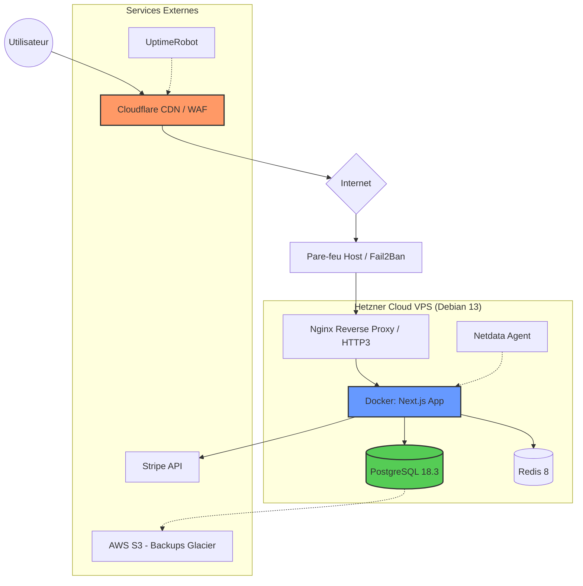

# Architecture Technique — Brek

## 1. Vue d'Ensemble
L'architecture de Brek est conçue pour offrir une expérience "Luxe" : une latence minimale, une sécurité robuste et une fiabilité élevée, tout en respectant un budget de démarrage maîtrisé.

## 2. Schéma d'Architecture

## 3. Stack Technologique

| Composant | Technologie | Version | Rôle |
| :--- | :--- | :--- | :--- |
| **OS** | Debian 13 | Trixie | Stabilité et empreinte mémoire réduite (~150MB overhead). |
| **Serveur Web** | Nginx | 1.30.0 | Terminaison HTTP/3 (QUIC) et Brotli. |
| **Runtime** | Node.js | 22 LTS | Performance asynchrone pour l'App Router. |
| **Base de Données** | PostgreSQL | 18.3 | Partitionnement natif et recherche plein texte. |
| **Cache** | Redis | 8.0.1 | Sessions et panier en temps réel. |
| **Conteneurisation** | Docker | 27.x | Isolation et reproductibilité. |

## 4. Stratégie de Performance & Latence
L'objectif est un **TTFB < 200ms** mondial :
1. **Compression Brotli (Level 6)** : Gain de 20% sur le poids des assets par rapport à Gzip.
2. **HTTP/3 (QUIC)** : Élimination du blocage en tête de ligne (Head-of-Line blocking).
3. **Edge Caching** : Mise en cache agressive sur 300+ PoPs Cloudflare avec purge par API.

## 5. Résilience & Sauvegardes
Application de la stratégie **3-2-1** :
- **3 copies** : Production, Snapshot local (Hetzner), Backup distant (S3).
- **2 supports** : NVMe (Hetzner) et Object Storage (AWS).
- **1 hors-site** : Région AWS S3 différente de l'infrastructure principale.

**Métriques cibles :**
- **RPO (Recovery Point Objective)** : 15 minutes (via WAL archiving).
- **RTO (Recovery Time Objective)** : 30 minutes (Redéploiement automatisé).

## 6. Monitoring & Alerting
- **Monitoring Externe** : UptimeRobot (Check toutes les 60s depuis 5 zones).
- **Observabilité Locale** : Netdata Agent (Surveillance CPU/RAM/IO temps réel).
- **Notifications** : Centralisation via Telegram Bot avec escalade Twilio (Appel vocal) si non acquitté sous 5 min.

## 7. Sécurité
- **WAF** : Protection Cloudflare contre le Top 10 OWASP.
- **Hardening SSH** : Désactivation root, port non-standard, authentification par clé uniquement.
- **Fail2Ban** : Bannissement automatique des tentatives de force brute.
- **Data Privacy** : Chiffrement AES-256 au repos, pas de stockage local de données bancaires (Stripe Elements).
